# Pasada final de pulido — informe

**Rama:** `fable-pulido`, creada desde `rediseno-2026` · **Fecha:** 18 de septiembre de 2026
**Nada publicado.** `main` y `rediseno-2026` están sin tocar; la rama no se ha subido a GitHub.

## En una frase

Los tableros dejan de parecer esquemas y pasan a ser ventanas de producto; el marino y el cobre
tienen cuerpo sin dejar de ser los de la casa; se arregla un fallo que dejaba pegados títulos y
cifras en varias secciones; funciona en los seis tamaños pedidos; y el código queda más corto y dice
la verdad. **Ningún texto aprobado cambió.**

## Los commits, para quedarte con unos y descartar otros

| # | Commit | Qué es | Se puede descartar solo |
|---|---|---|---|
| 1 | `2b00361` `refactor(css)` | `registro.css` (2.822 líneas) partido en ocho hojas por sección. **Sin cambio visual**: 32 capturas idénticas píxel a píxel | No conviene: todos los demás tocan esas hojas. Es solo mover |
| 2 | `1d65f3f` `feat(cuadros)` | Las interfaces de muestra como ventanas de producto | Sí (con el 4 y el 7) |
| 3 | `db97596` `feat(color)` | Marino y cobre con cuerpo; tokens de sombras y degradados; DESIGN.md | Sí (con el 7) |
| 4 | `c2ab222` `fix(cuadros)` | La fecha de una tarjeta de KLINODA se cortaba | Va con el 2 |
| 5 | `2f91167` `style(pulido)` | El reinicio de márgenes, la banda de KLINODA, «Agendar · 20 min», preguntas | Sí |
| 6 | `0059749` `fix(responsive)` | Arreglos de teléfono y tableta | Sí |
| 7 | `a7e5f87` `refactor(codigo)` | Duplicaciones, restos, nombres, README y comentarios | Sí. **Depende del 2 y del 3**: hace que los cuadros lean los tokens de color |
| 8 | `docs(pulido)` | Este informe, CONSTRUCCION.md y DESIGN.md | Sí |

Para descartar uno: `git revert <hash>`. El 7 es el último de código a propósito, para que se pueda
quitar limpio. Si descartas el 3 (color) quedándote con el 7, hay que devolver a `cuadros.css` tres
valores literales (la sombra, `#f8f6f2` y `#fbefe6`): son las tres líneas que ese commit cambia
en `estilos/cuadros.css`, más la sombra del tablero en `estilos/klinoda.css`.

---

## 1 · Los cuadros

Antes eran hojas blancas con filetes grises: se leían como un esquema. Ahora son ventanas de
producto: barra con el isotipo, riel de iconos, un suelo apenas tintado y cartas blancas con sombra
corta. La profundidad va de dentro afuera (suelo → carta → globo).

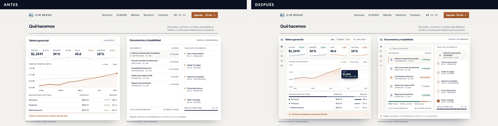

**Tablero gerencial.** Indicadores con su variación (flecha dibujada; verde si va bien, cobre si pide
atención) y chispa con área; ventas contra meta con lo real, **la proyección punteada** y el globo
del mes; el reparto de ingresos en una barra; el aviso en cobre.

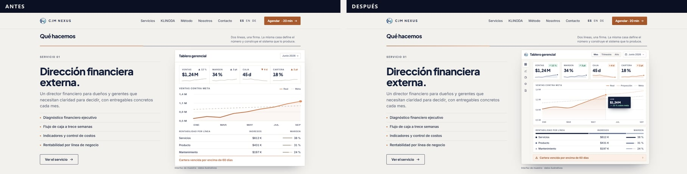

> **Un detalle de oficio: los datos ahora cuadran.** El tablero decía «Junio 2026» pero el gráfico
> llegaba a septiembre, y el punto de junio marcaba 0,9 M con un indicador de $1,24 M. Ahora lo real
> llega a junio y lo demás es proyección; junio vale 1,24 M, un 12 % sobre mayo; las tres líneas
> suman 1,24 M; el trazo sigue cruzando la meta (entre abril y mayo). Quien sabe de finanzas mira
> justo eso.

**Portal de documentos.** Buscador, fichas de icono y etiquetas de estado con color, el reparto de
los 128 por estado (96 + 21 + 11), la traza con un nodo por paso hasta el sello y doce tramos de
reglas que se cumplen uno a uno. Las filas ocupan el alto: ya no queda el hueco en blanco de antes.

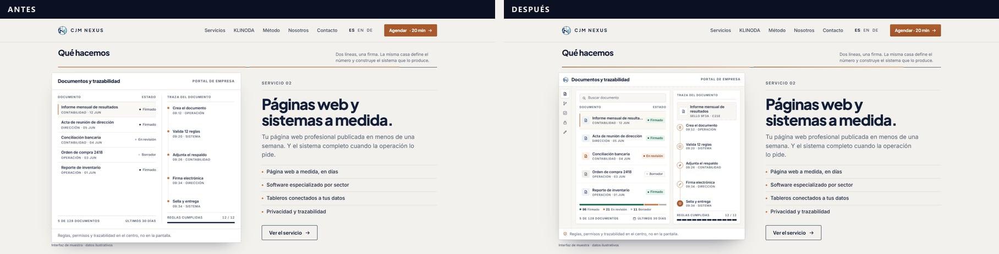

**KLINODA.** Pestañas con las tres hojas **reales** de su portal de empresa (Plazos, Certificados,
Personal: las saqué de `portal_empresa/panel.html`, sin inventar ningún módulo), la línea de 90 días
con cada vencimiento **en su día**, y fichas de icono. Sin nombres, sin nada clínico, sin totales por
aptitud.

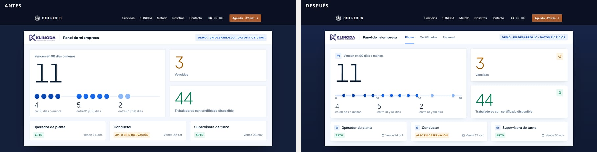
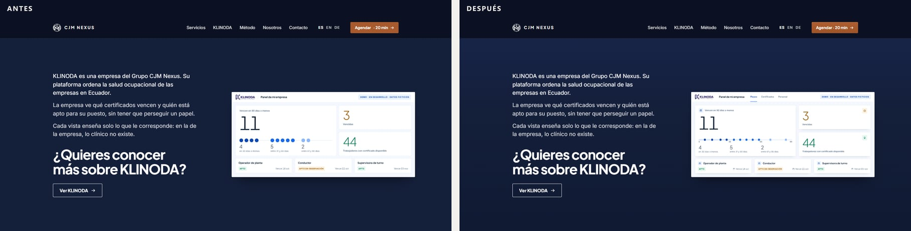

**En el teléfono.** Los puntos de la línea de plazos ya no se pisan (antes los del segundo tramo
montaban sobre los del tercero).

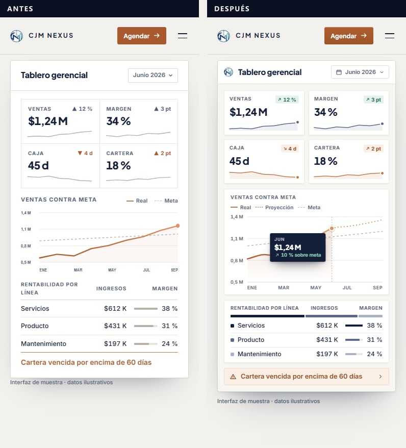
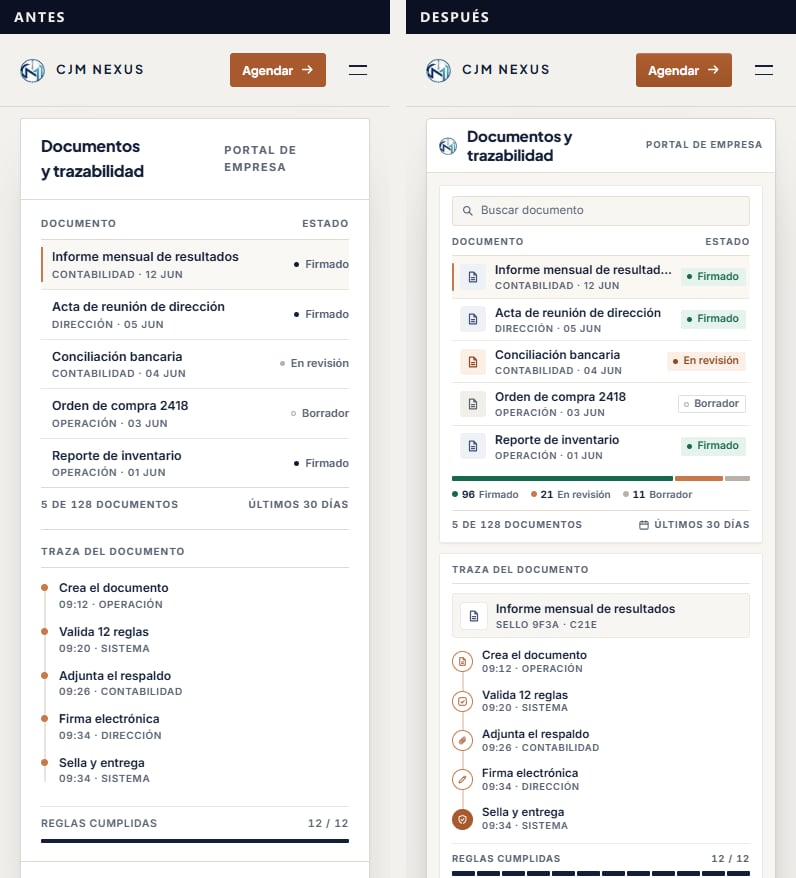
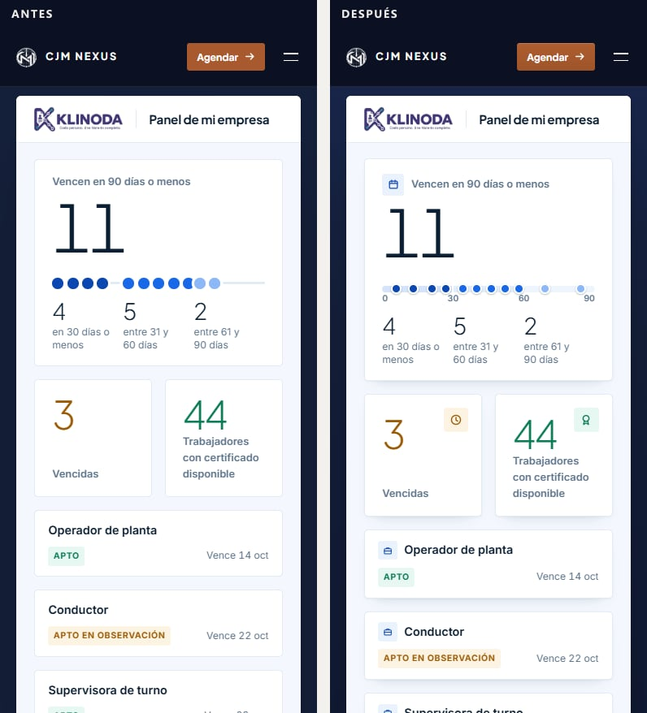

**Páginas interiores.** El tablero completo de dirección financiera (doce meses en barras: marino
los que pasan la meta, cobre el mes del tablero; alertas con su tono, porque «Margen sobre meta» es
una buena noticia y antes iba en color de aviso) y la vista de aptitud de KLINODA, con la misma
ventana.

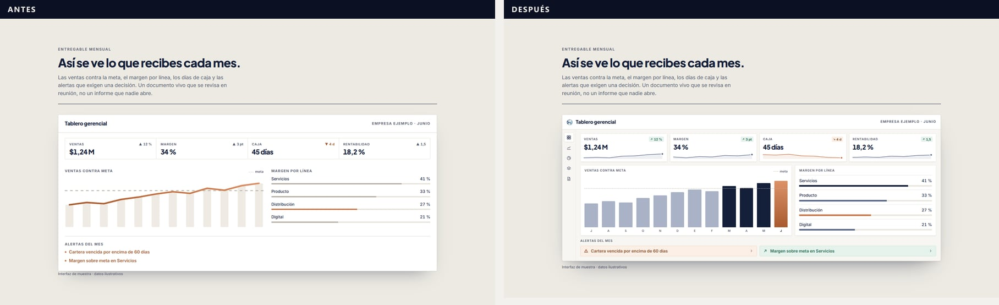
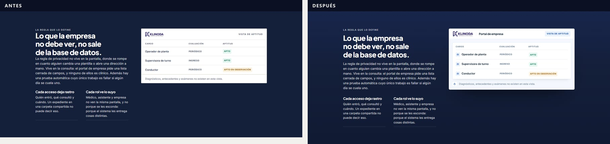
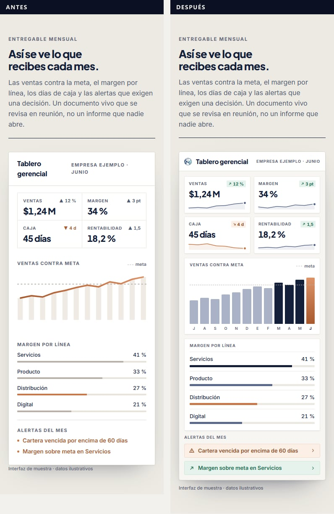
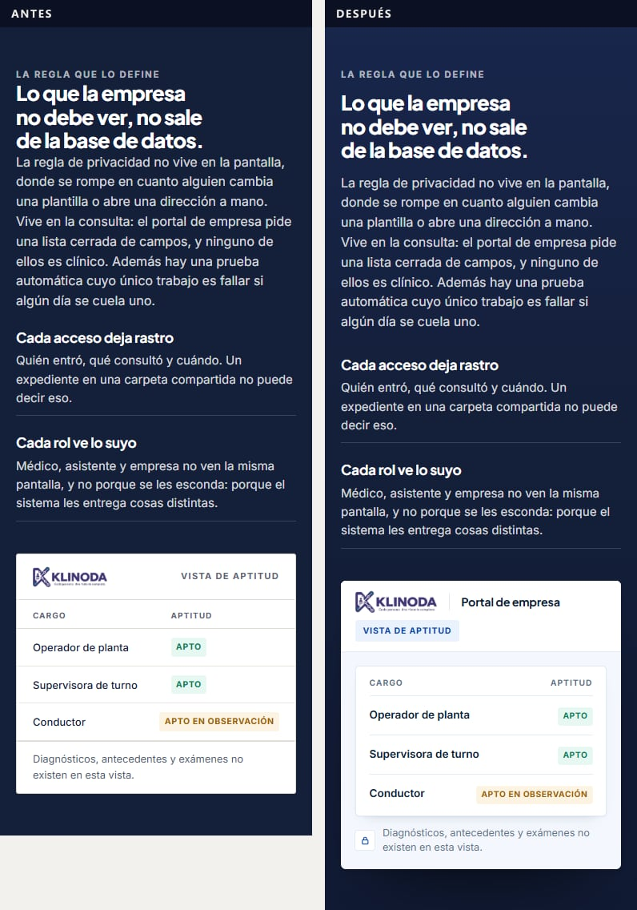

**Por dentro:** un juego propio de iconos (`Icono.jsx`; ningún «▲» de sistema hace de icono), las
piezas compartidas de las dos ventanas (`Ventana.jsx`: el 50/50 también es material), la geometría de
los gráficos (`lib/graficos.js`) y consultas de contenedor, para que la misma pieza valga a 320, 500
y 624 px. Los trazos se descubren con máscara: con `stroke-dashoffset`, al estirarse el SVG, el trazo
se quedaba corto. El «dibujo» de los dos tableros sigue durando lo mismo (1,6 s).

## 2 · El color

La identidad no cambia: papel, marino y **un solo acento cobre**. Cambia que el marino y el cobre
dejan de ser planos justo donde hacen de superficie.

- **El velo de la portada** pasa de marino hondo (casi negro, dejaba el metraje gris) a **marino
  vivo** `#18264C`. Detrás del texto lleva una sombra ancha, sin color propio: el contraste de la
  entrada, medido sobre el 10 % más claro del fondo que tiene debajo, sube de 6,1:1 a 7,9:1.
- **«Agendar»:** cobre con la luz arriba y un filo claro en el borde. El tono más claro da 4,7:1.
- **La noche gana hondura**, de marino vivo arriba a marino hondo abajo. Entra solo del 90 % de
  oscuridad en adelante: el tramo crítico del 50 al 59 % sigue siendo marino plano y sus cuentas de
  contraste **no se tocan**. El texto más tenue de la noche queda en 5,9:1.
- El «+» de las credenciales en cobre hondo; la regla de «Qué hacemos» y el filete del cierre, de
  cobre apagado a encendido (el mismo degradado que el trazo del gráfico).
- Lo que pinta el navegador también es de la casa: selección, barra de desplazamiento y controles.

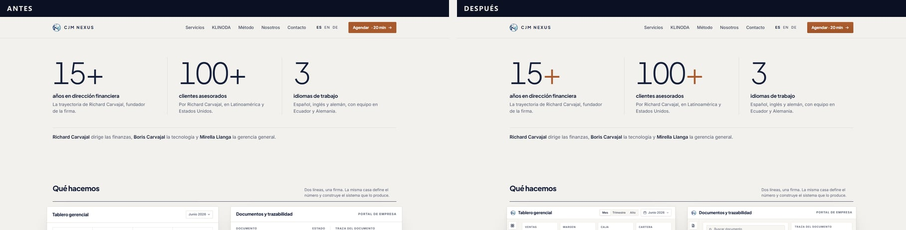
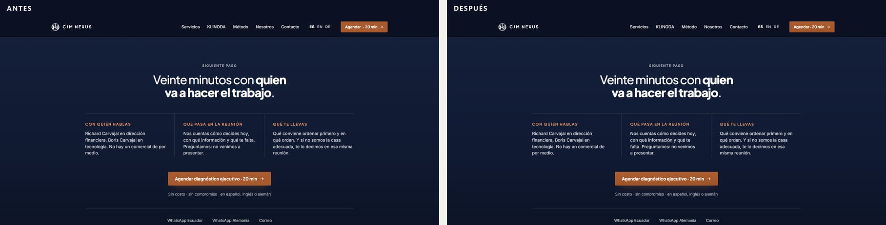

**DESIGN.md:** *The Three Gradients Rule* pasa a ser *The Tonal Gradient Rule*: un degradado va
siempre de un tono a otro más hondo **del mismo color**; nunca en texto, nunca de un color a otro.
Tus rechazos siguen en pie: sin orbes, manchas, halos ni vidrio. Tres matices nuevos (`tinta-viva`,
`papel-claro`, `cobre-tinte`) y sombras y degradados como tokens de `REGISTRO`.

**Dentro de las ventanas hay un verde** (`#17694B`) que dice «va bien» en variaciones y estados,
como en cualquier producto. No sale de ahí: en la página, el énfasis sigue siendo cobre.

## 3 · Pulido

**El hallazgo de esta pasada.** El reinicio `.registro p, h2, ul { margin: 0 }` le ganaba por
especificidad a las clases de una sola palabra (`.muestra`, `.titulo-pag`, `.entrada-pag`,
`.cifras-pag`, `.lista-pag`…), así que sus márgenes **nunca se aplicaban**: en varias secciones la
referencia, el título, la entrada y las cifras iban pegados. Pasa a `:where()`, que no suma
especificidad.

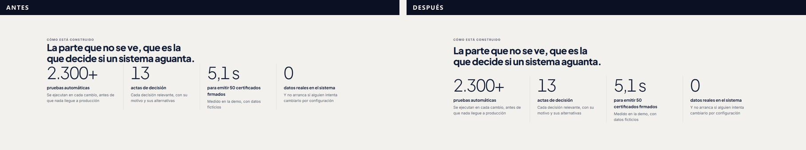

- La banda de KLINODA sin cifras dejaba vacía su mitad derecha: ahí va ahora el botón.

  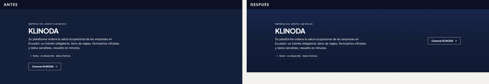
- «Agendar · 20 min» tenía un hueco doble antes del punto medio.
- El rótulo «Cómo va» de las ofertas pisaba el filete de la primera columna.
- Las preguntas frecuentes responden al ratón y la respuesta llega con la curva de la casa. El botón
  de contorno también se pulsa. Donde están quietos, los tableros resaltan la fila bajo el ratón.

## 4 · Responsive

Las cinco páginas en **390×844, 768×1024, 1024×768, 1366×768, 1536×730 y 1920×1080**: ningún
desbordamiento horizontal, ningún elemento fuera de la ventana, ningún error de consola. Probado
además a 360×740.

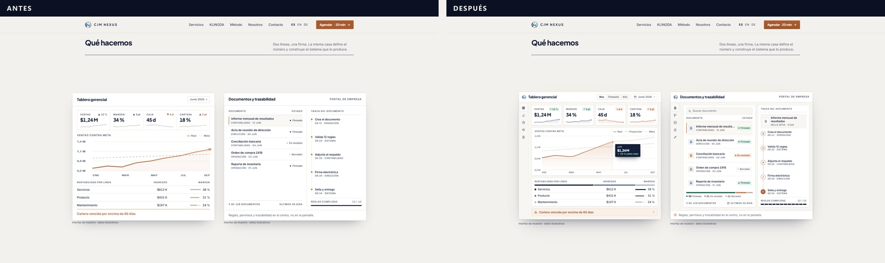
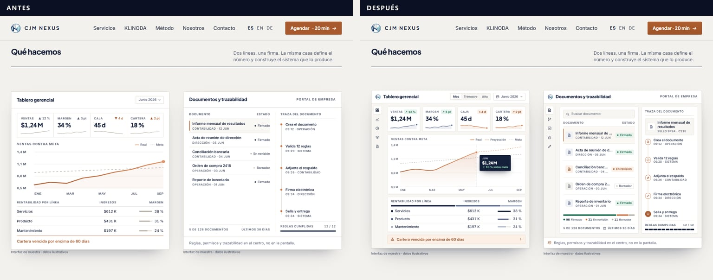
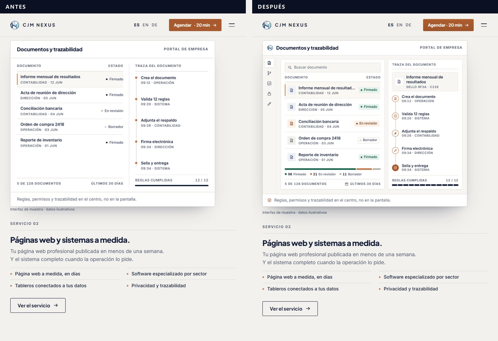

Lo que se arregló: el crédito de la imagen cruzaba la señal de «sigue» en el teléfono; «Agendar
diagnóstico ejecutivo · 20 min» dejaba «min» sola en una línea; «Supervisora de turno» se cortaba
con puntos suspensivos a 768; en `/servicios` a una columna el gráfico se estiraba a 960 px;
«38 %» se partía en dos líneas a 360.

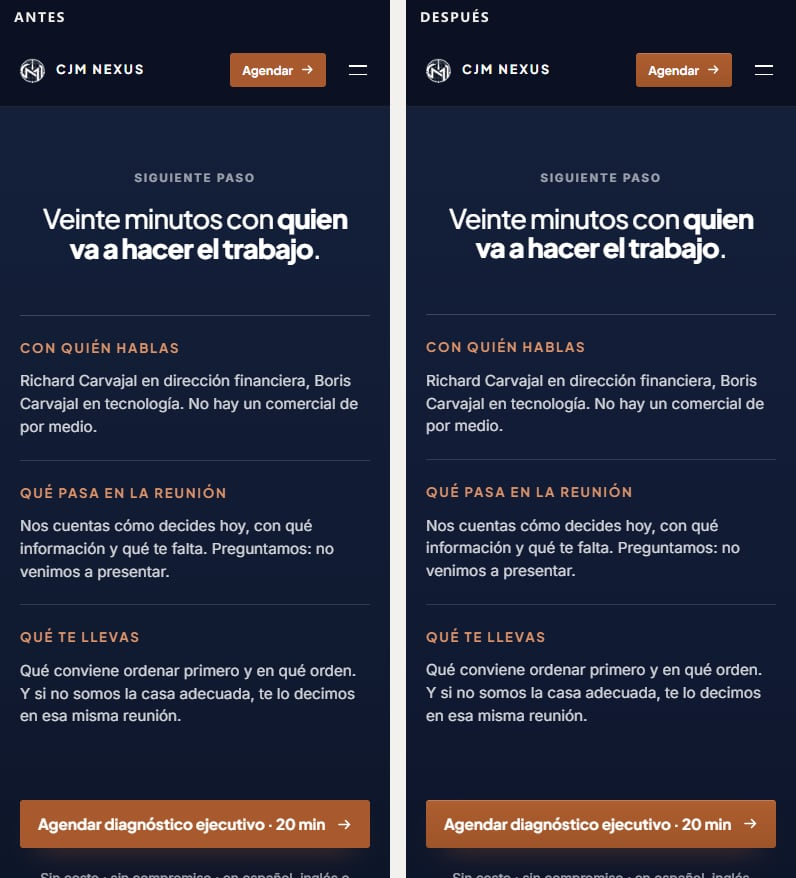

## 5 · Código

- Las dos escenas fijadas repetían la sangría, el bucle que baja la letra y toda la configuración de
  ScrollTrigger: ahora son `sangriaDe`, `encoge`, `lineaFijada` e `irAlPunto`. **Comprobado:** las
  escenas, capturadas en sus pausas en tres tamaños, son idénticas píxel a píxel.
- Vigilar una zona oscura estaba escrito dos veces y el alto de la cabecera, tres.
- Fuera lo que nadie leía: `fijaEscenas`, `CONSULTA_ESCENAS`, `DURACION`, `SALIDA`, `PANTALLAS`,
  `reiniciarSuperficie`, `index` y `tone` de las tarjetas, `.pie-pag`.
- `puntos(n)` formateaba millares: pasa a `conMillares`.
- **El README describía el sitio anterior** (Framer Motion, Recharts, react-i18next…): reescrito. El
  comentario de la página de KLINODA decía que su primer lector es el médico, contra la regla 7.

---

## Verificación

| Qué | Resultado |
|---|---|
| `npm run build` | **Sin errores ni avisos.** 20 páginas estáticas. La portada pesa 2,4 kB más de JS (11,7 kB); lo compartido no cambia (87,3 kB) |
| `npm run lint` | Sin avisos |
| Seis tamaños × cinco páginas | Sin desbordes, sin elementos fuera, sin errores de consola |
| «Reducir movimiento» | Todo quieto y entero: sin vídeo, sin fijado y sin noche; KLINODA y el cierre, bandas marino por sí mismas |
| Teclado | Portada: 18 paradas; dirección financiera: 23. **Todas con contorno de foco y a la vista**, también los botones dentro de las escenas. El menú del teléfono abre con Enter, cierra con Escape y devuelve el foco |
| Contraste AA | Calculado par a par para todo color nuevo: mínimo 4,55:1 (texto secundario de KLINODA sobre su fondo). El tramo de la noche no se tocó |
| Detector de Impeccable | 0 hallazgos en los 28 archivos de interfaz cambiados |

---

## Lo que tienes que aprobar: microcopia nueva en las interfaces

Para que un tablero parezca producto hacen falta rótulos de producto. Todos están en `src/content/`,
marcados, y en «Textos por aprobar» de CONSTRUCCION.md. Son rótulos de la interfaz de muestra, no
texto de la firma, y cualquiera se quita borrando una línea.

| Dónde | Texto |
|---|---|
| Tablero gerencial | «Mes», «Trimestre», «Año» · «Proyección» · globo «JUN · $1,24 M · 10 % sobre meta» |
| Portal de documentos | «Buscar documento» · «Sello 9F3A · C21E» · «96 Firmado · 21 En revisión · 11 Borrador» |
| KLINODA | «Plazos», «Certificados», «Personal» (rótulos reales de su portal) · marcas «0 · 30 · 60 · 90» |
| Tablero de finanzas (página) | Las iniciales de doce meses, de julio a junio |

## Textos que te propongo, sin haberlos cambiado

1. **«Imagen provisional de archivo»**, a la vista en la portada, le dice al visitante que la web
   no está terminada. Propongo quitar el rótulo al publicar (y conservar la atribución que exija la
   licencia donde corresponda), o esperar al vídeo propio.
2. **Las referencias en versalitas sobre cada título** de las páginas interiores («Cómo trabajamos»,
   «Entregables», «Honestidad por delante»…). Una sobre cada sección es el gesto que más se lee como
   plantilla. Propongo dejarlas solo donde ordenan («Servicio 01», «01 · …») y quitar las demás.
3. **En teléfonos de 360 px** el botón principal parte en dos líneas. Si quieres una sola, una
   versión corta para móvil: «Agendar diagnóstico · 20 min».

## Decisiones mías, reversibles

- El verde dentro de las ventanas (estados y variaciones).
- La regla del degradado tonal en lugar de «solo tres degradados».
- El «+» de las credenciales en cobre hondo.
- El botón a la derecha en la banda de KLINODA cuando no trae cifras.
- Retirar las constantes de movimiento que nadie leía (siguen escritas en DESIGN.md).

## Lo que vi y no toqué

- **Antes de publicar:** «Privacidad» y «Aviso legal» del pie llevan a `#`; `/en` y `/de` sirven
  español y son indexables; las imágenes Open Graph siguen con el eslogan antiguo.
- El detector sigue marcando tamaños de letra fuera de la rampa de DESIGN.md en `portada.css` y
  `SiteHeader.jsx`. Vienen de la maqueta aprobada; no son de esta pasada.
- `.impeccable/design.json` está más viejo que DESIGN.md (ya lo estaba). Se regenera con
  `/impeccable document`.
- `public/logo.png` (817 KB) no lo usa la web; solo el guion de marca. Hay versiones `.webp` de los
  isotipos que la web no usa todavía.
- Las claves de `home.es.js` están en español y las de `servicios.es.js` y `klinoda.es.js` en inglés.
- El primer `npm run build` en el worktree se quedó colgado sin CPU (OneDrive): se mata, se borra
  `.next` y el segundo compila. Anotado en CONSTRUCCION.md.
